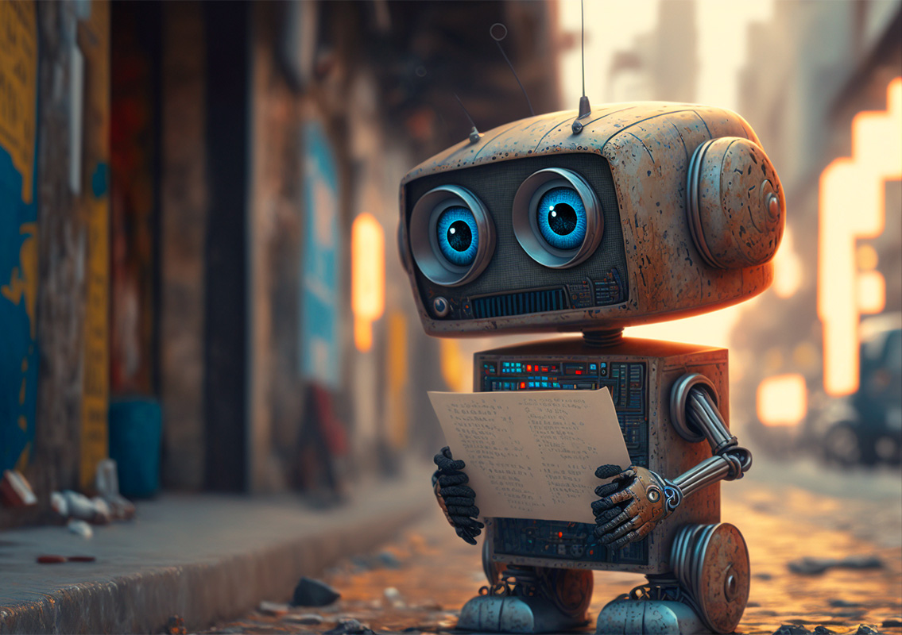

# Git Practice
## My Article
[Generative AI in Edtech](https://www.businessinsider.com/education-experts-teachers-generative-ai-chatgpt-classroom-2023-1)
## What I find Interesting
This article is pretty cool because as we know, tools such as ChatGPT and other generative AI have become increasingly popular in educational settings.  Unfortunately, they have come under fire because of their role in simplifying cheating and pushing back educational efforts.  The article focuses on the positive aspects that come with using generative AI in a classroom setting as it helps boost student creativiy and even addresses the real problem underlying education in Western settings: that is the focus on passing mandatory exams and reducing a students value into a mere letter grade--a system which has always thrived on cheating.

Instead of shunning generative AI educators should embrace it for what it is: a growing technology that will become more prevalent in our daily lives.  For example, a professor at the University of Leeds has been using AI in her classroom since 2018 by having her students "write" essays with text generators that can respond to different personalized prompts. After the model comes up with an answer, students break down these blocks of text and discuss the AI-generated arguments. 
***
**Zander Chen**: I totally agree with the article. Using AI doesn't mean we lost our creativity. Often times, we use generative AI just to save our times from the redundant, repeatative drills.

